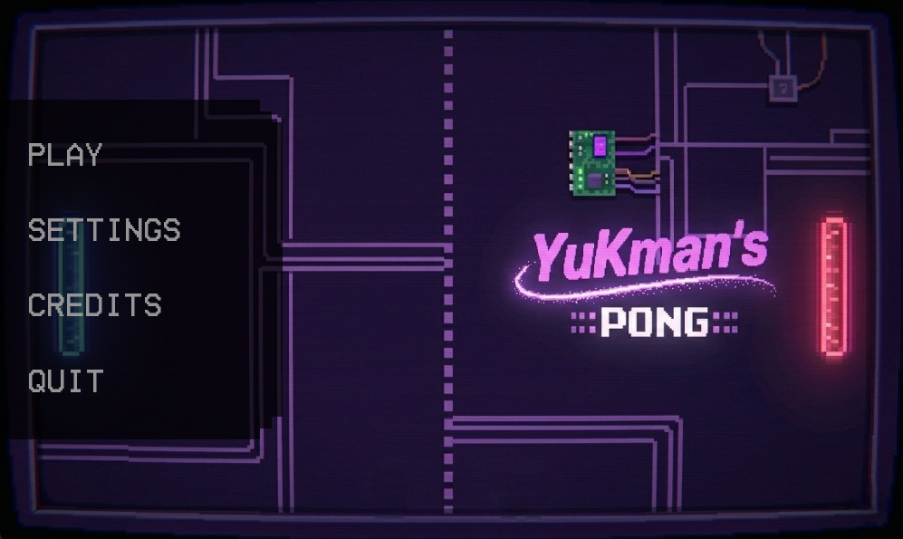
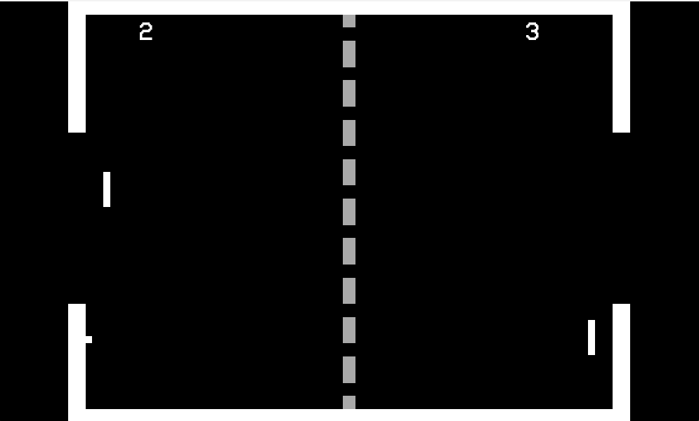
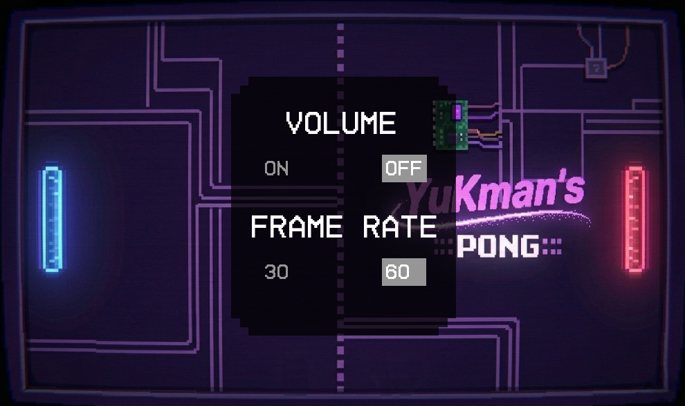
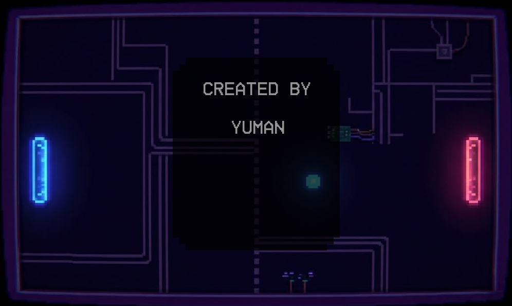

<<<<<<< HEAD
# YuKman's Pong 🎮

A redesigned classic Pong game built from scratch in C++ with SFML 3, featuring object-oriented architecture, a complete menu system, local two-player gameplay, and custom-made assets.

This project is the refactored version of my first SFML game. The original codebase was written procedurally across multiple files with no real architectural structure — no classes, no separation of concerns, and no memory management strategy. This version was rebuilt using OOP principles, smart pointers, encapsulation, and separation of responsibilities — reflecting the C++ fundamentals I am currently studying.


---

## 📸 Screenshots

### Main Menu


### Gameplay


### Settings


### Credits


---

## 🎮 Gameplay

- Two-player local multiplayer on the same keyboard
- Feat: Reworked randomized ball direction and angle on each serve
- Persistent score tracking across rounds
- Pause state — press Escape during gameplay to return to menu; game state, scores, and positions are preserved on return
- Feat: Custom-built terrain with new goal zones and boundary collision

---

## 🕹️ Controls

| Action         | Player 1 | Player 2     |
|----------------|----------|--------------|
| Move Up        | `W`      | `↑`          |
| Move Down      | `S`      | `↓`          |
| Pause / Back   | `Escape` | `Escape`     |

---

## ⚙️ Features

- Main Menu with Play, Settings, Credits, and Quit
- Settings Menu — toggle Volume On/Off and set FPS (30 or 60)
- Credits Screen
- Feat: This Refactored Version Has Sound Effects
- Hover Effects on all buttons
- Delta Time movement — consistent speed across all hardware

---

## 🛠️ Built With

- C++20
- SFML 3.0.2 — graphics, windowing, and input
- Visual Studio 2026 Community

---

## 📁 Project Structure

Pong-SFML-CPP/
├── src/
│   ├── main.cpp
│   ├── Game.cpp
│   ├── Player.cpp
│   ├── Ball.cpp
│   └── Button.cpp
├── include/
│   ├── Game.h
│   ├── Player.h
│   ├── Ball.h
│   └── Button.h
├── assets/
│   ├── BlackGameFont.ttf
│   ├── MenuWallpaper2.jpg     # AI-generated (Nano Banana)
│   ├── MenuSprite.png         # Hand-made
│   ├── TerrainSprite.png      # Hand-made
│   ├── TerrainLine.png        # Hand-made
│   ├── ball.ogg
│   ├── goal.ogg
│   └── button.ogg
├── screenshots/
└── README.md

---

## 🚀 How to Build

### Requirements
- Visual Studio 2022/2026 with Desktop development with C++
- SFML 3.0.2 for Visual C++

### Setup

1. Clone the repository:
```bash
git clone https://github.com/YumanKh/Pong-SFML-CPP
```

2. Download [SFML 3.0.2](https://www.sfml-dev.org/download.php) for Visual C++ 64-bit

3. In Visual Studio, open Project Properties:
   - VC++ Directories → Include Directories: add `path/to/SFML/include`
   - VC++ Directories → Library Directories: add `path/to/SFML/lib`
   - Linker → Input → Additional Dependencies: add:
     ```
     sfml-graphics-d.lib
     sfml-window-d.lib
     sfml-system-d.lib
     ```

4. Copy all `.dll` files from `SFML/bin/` into your project output directory

5. Copy the following asset files into the same directory as your `.exe`:
   - `BlackGameFont.ttf`
   - `MenuWallpaper2.jpg`
   - `MenuSprite.png`
   - `MenuQuitSprite.png`

6. Build with Ctrl+Shift+B and run with Ctrl+F5

---

## 👤 Author
Yuman Khoufache
First-year Computer Science student at Austin Community College. 
Beyond coursework, I actively pursue self-directed learning to develop cleaner architecture and stronger programming fundamentals. This project reflects my efforts.

---

## 🙏 Special Thanks

- **Claude (Anthropic)** — Used for technical debugging assistance.
- **SFML Team** — for the library
- **Gemini / Nano Banana 2** — asset creation (menu wallpaper)

---

## 📜 License
© 2026 Yuman Khoufache — Released with no copyright restrictions. Free to use, modify, and distribute.


# Pong-SFML-CPP
>>>>>>> 6def752e0dbee19eb130b7e92ba310c3a7f6fe58
